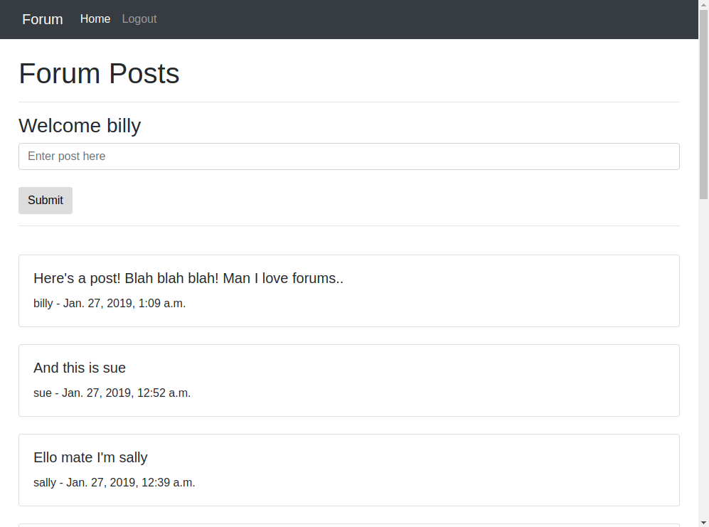
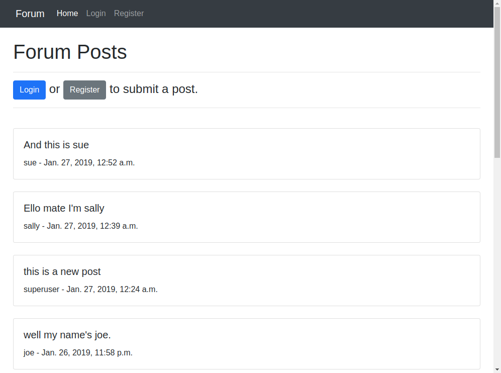
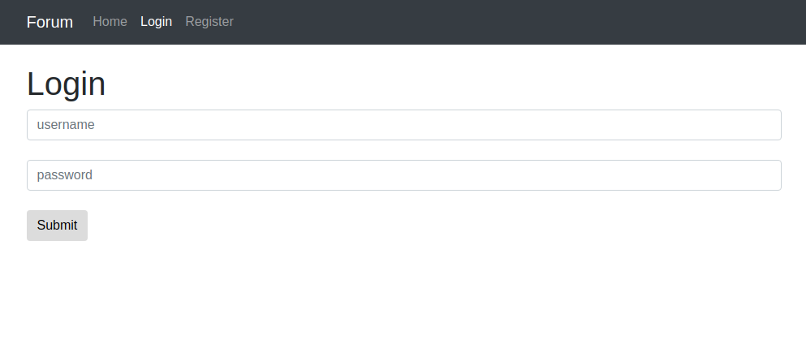
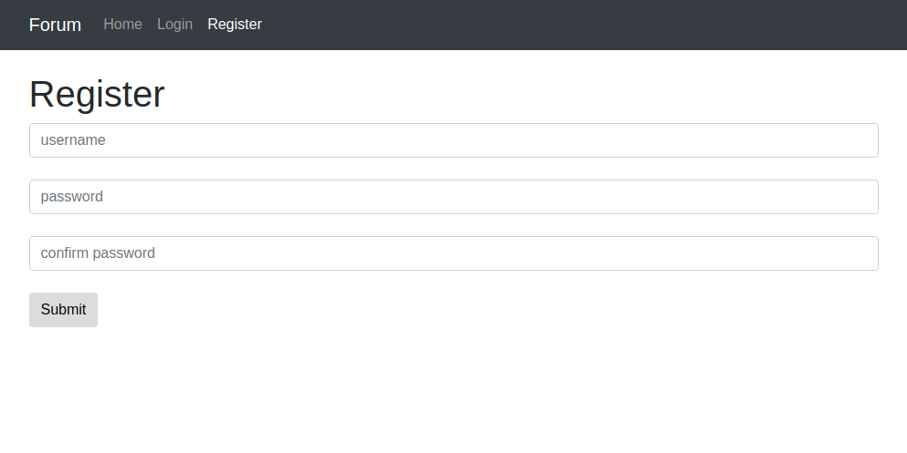

# Django_forum_exampe1
 

Here I demonstrate a simple forum built with django. The forum allows users to log in and post to the home page. Each post is added to the top of the list. If a user does not have an account yet, they can create one on from the register page.

A user cannot post without first logging in or creating an account. The menu options also adapt by displaying 'Login' and 'Register' when not logged in and 'Logout' when already logged in.

## Install
 

1. Clone this repository.
2. Run 'pip install django==2.1.1' in your terminal.
3. In the terminal, move to the folder containing the manage.py file.
4. Run 'python manage.py runserver'.
5. Open your web browser to the url specified in the terminal.

There are some users already created for convenience. Their passwords are all the same as their usernames:

1. superuser. This user is needed to access the django admin.
2. billy.
3. bob.
4. joe.
5. sally.
6. sue.

<h2>Forum home once logged in</h2> 

 

<h2>Forum home while logged out</h2> 

 

<h2>Login page</h2> 

 

<h2>Register page</h2> 

 

<h2>Register page</h2> 

 

Posts can also be created, edited, and deleted by the superuser in the admin included with django.

